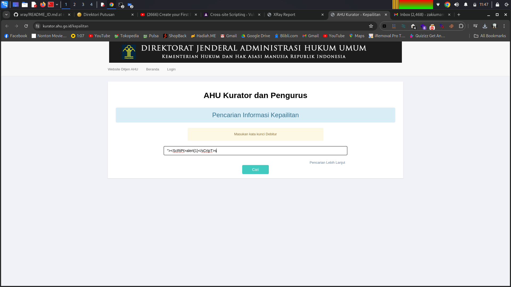
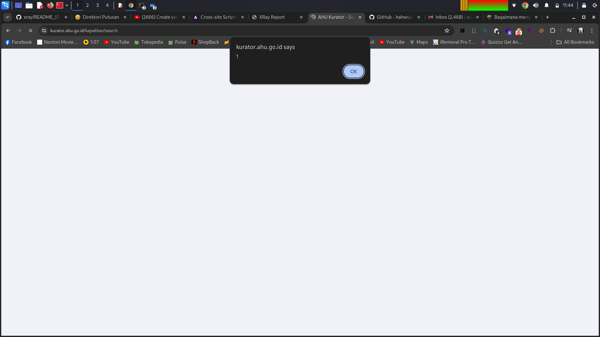

Berikut adalah **README** yang terpisah untuk temuan **XSS vulnerability** di **[https://kurator.ahu.go.id/kepailitan/search](https://kurator.ahu.go.id/kepailitan/search)**:

---

# XSS Vulnerability Discovery at [https://kurator.ahu.go.id/kepailitan/search](https://kurator.ahu.go.id/kepailitan/search)

This repository documents the discovery of a **Cross-Site Scripting (XSS)** vulnerability found on the website **[https://kurator.ahu.go.id/kepailitan/search](https://kurator.ahu.go.id/kepailitan/search)**.

## Tools Used:

* **Manual Payload Injection**: The vulnerability was found by manually injecting an **XSS payload** into the search field on the **search page**.

## Vulnerability Description:

An **XSS vulnerability** was identified in the **search input field** on the page **[https://kurator.ahu.go.id/kepailitan/search](https://kurator.ahu.go.id/kepailitan/search)**. By injecting a simple JavaScript payload, we were able to execute arbitrary JavaScript code, demonstrating a potential **XSS attack** that could lead to **session hijacking** or **malicious actions** on behalf of the user.

### Exploit:

The following payload was injected into the **search input field**, which triggered the XSS vulnerability:

```html
"><script>alert(1)</script>
```

#### Screenshot of XSS Vulnerability:



### Payload Result:

Upon submission of the form with the above payload, the alert box below was triggered, confirming the presence of the XSS vulnerability.

#### Screenshot of Exploit in Action:



## Steps to Reproduce:

1. Visit the URL: [https://kurator.ahu.go.id/kepailitan/search](https://kurator.ahu.go.id/kepailitan/search).
2. Inject the payload `"><script>alert(1)</script>` into the search input field.
3. Submit the form.
4. An alert box will pop up, confirming the XSS vulnerability.

## Mitigation Recommendations:

* Implement **input sanitization** and **output encoding** to prevent script execution.
* Use the **HTTPOnly** flag for cookies to prevent JavaScript from accessing session data.
* Consider using **Content Security Policy (CSP)** headers to restrict the execution of untrusted scripts.

## License:

This project is intended for **educational purposes** and **ethical hacking** only. Always ensure that any security testing is conducted responsibly and with proper authorization from relevant authorities.

---

README ini menjelaskan temuan **XSS vulnerability** pada halaman **search** di **[https://kurator.ahu.go.id/kepailitan/search](https://kurator.ahu.go.id/kepailitan/search)**, dengan cara yang lebih sederhana dan langsung. Jangan lupa untuk menambahkan gambar atau file yang relevan pada repository Anda.
